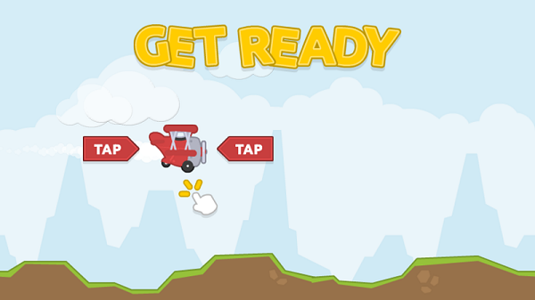
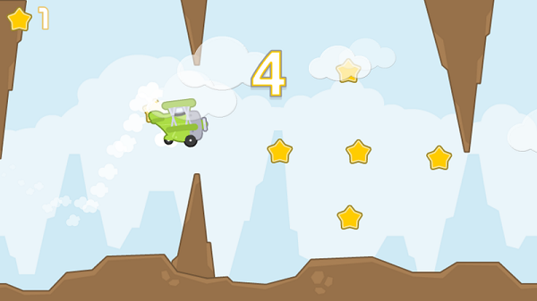

####TAPPY PLANE

 
*  C++
*  vs 2013
*  cocos2dx 3.3
*  cocos studio 2.0
    

 
This is a tiny game developed for cocos2dx learning!     
Perfectly run on my SUMSANG NOTE3!
 
I got all the art works from [opengameart.org](http://www.opengameart.org).
Special THX to [kenny's](http://www.kenny.nl) great work.

#####Basically,this is a flappy bird kind of game.
###But.
I think there is something more to learn.   
if you are a beginner of cocos2dx, i think this, my tiny project is good for study. ##maybe.   
 
#####Note:I am a noob!   
SO, if you find something wrong or bad.  
It will be happy to be noted.   

At last,here is some pics for this game:  
 
 
   
 
   

 
 
 

####At last!
   Happy coding!
